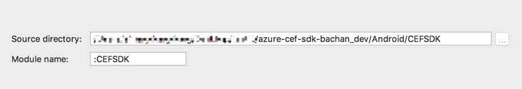
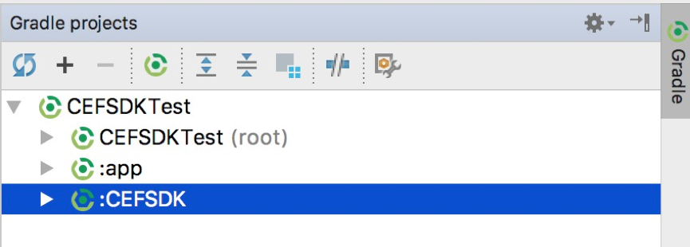
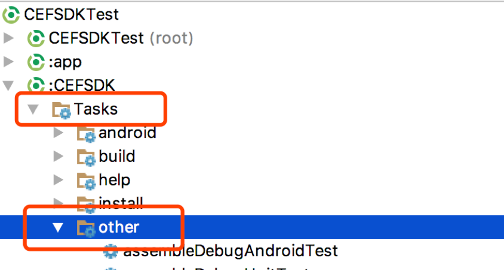
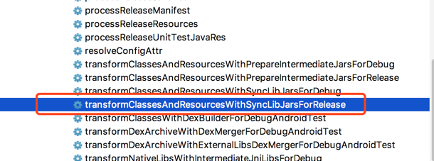
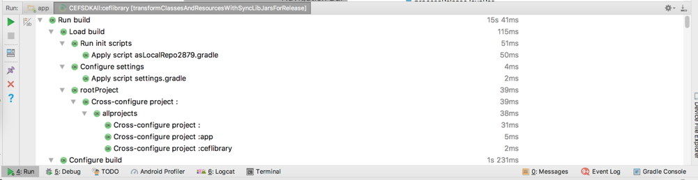
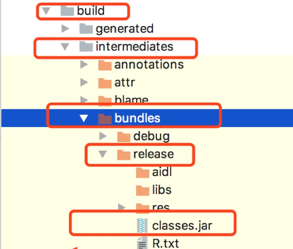
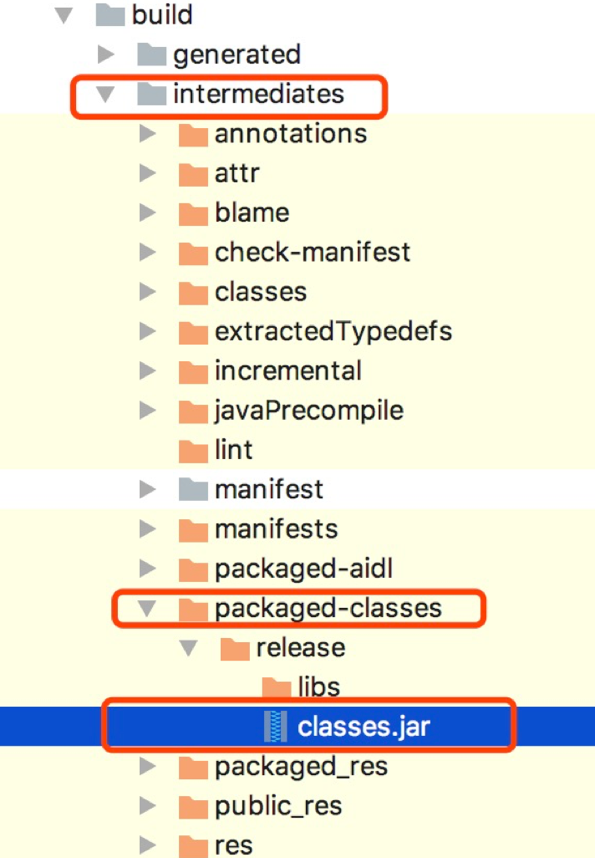
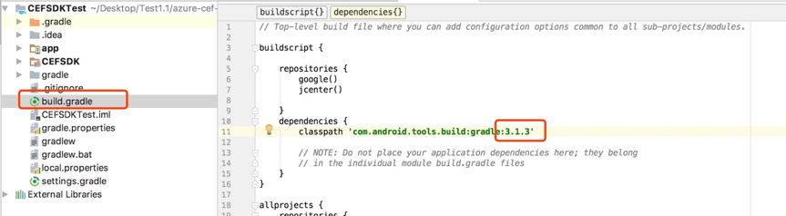
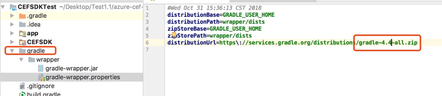

App module 为测试代码，CEFSDK module为sdk源码，按照下面步骤打包，把classes.jar修改成需要的名字之后，给用户即可。
 

1. 从github上把SDK源码下载下来之后，以下载的CEFSDKTest为例，依次点击File->New ->Import Module,选择好下载的CEFSDK之后，出现以下界面。

点击finish，等待编译完成。
 

2. 点击Android Studio右侧的Gradle。
 

3. 选取CEFSDK。

4. 选取 CEFSDK---Tasks ---other----鼠标左键双击transformClassesAndResourcesWithSyncLibJarsForForRelease.

双击之后，Android Studio下方会出现编译界面，等待编译完成。
 

5. 分两种情况：
 

 第一种情况：插件版本为 3.0.0+，Gradle版本为4.1+时:
 

CEFSDK module下   build—intermediate---bundles—release 包下的classes.jar  .修改成需要修改的名字，发送给用户即可。

第二种情况：插件版本为 3.1.0+，Gradle版本为4.4+时:

# 如何查看插件版本和Gradle版本
 
插件版本位置：项目节点下build.gradle

 

Gradle版本位置：

# 插件版本和Gradle版本对照关系：
https://developer.android.google.cn/studio/releases/gradle-plugin#updating-plugin

