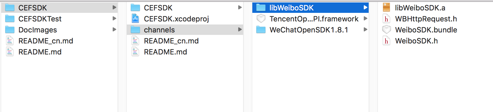

# How to use Azure CEF SDK Sample code

## Prerequisties
1. Download following SDKs from their offical webSite.

    | SDK | Version| Offical Link|
    |:--:|:--:|:--:|
    |Weibo (libWeiboSDK)| 3.1.4 | https://github.com/sinaweibosdk/weibo_ios_sdk|
    |QQ (TencentOpenAPI)| 3.3.3 | http://wiki.connect.qq.com/sdk下载 |
    |WeChat (WeChatOpenSDK) | 1.8.1 | https://open.weixin.qq.com/cgi-bin/showdocument?action=dir_list&t=resource/res_list&verify=1&id=open1419319164&token=&lang=zh_CN |

2. UnZip and put under folder **channels** like following shows:

